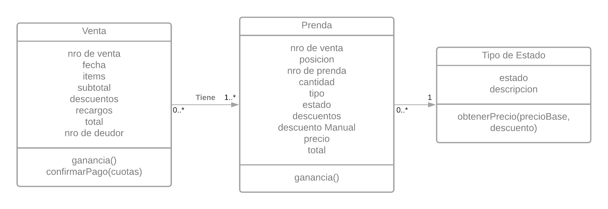

# Maco Wins

## Contenido

- Consigna
  - Requisitos
  - Enunciado
- Resolución

## Consigna

### Requisitos

- Identificar los requerimientos
- Presentar una solución utilizando el paradigma objetos
- Explicar lo necesario en prosa
- Si se descarta alguna alternativa durante el desarrollo de la solución, o si se tiene otra solucióm, explicarla brevemente

### Enunciado

La conocida empresa de ropa formal para caballeros, Macowins, es capaz de darle soporte a la venta de prendas. Un fragmento de la grabación del analista con el cliente:

> “Queremos saber el precio de venta de una prenda y sus tipos, los tipos de prenda son: sacos, pantalones, camisas.”

El cálculo del precio de una prenda es, el precio propio de la prenda modificado según el estado de la prenda, que pueden ser:

- _Nueva_: en este caso no modifican el precio base.
- _Promoción_: Le resta un valor fijo decidido por el usuario.
- _Liquidación_: Es un 50% del valor del producto.

Ah, un requerimiento más: Macowins registra las ventas de estas prendas y necesita saber las ganancias de un determinado día.

> “Cada venta tiene asociada las prendas que se vendieron, su cantidad y la fecha de venta.
> Las ventas pueden ser en efectivo o con tarjeta. En el caso que sea con tarjeta, tienen el mismo comportamiento que en efectivo (el cual no modifica el precio), sólo que se le aplica un recargo según la cantidad de cuotas seleccionadas (cantidad de cuotas \* un coeficiente fijo + 0.01 del valor de cada prenda).”

## Resolución

### Requerimientos

- Permitir consultar: precio, tipo de una venta de prenda.
- Resumen de ganacia de un determinado día.

### Solución



Tomo como Hipótesis de trabajo que se pide presentar un producto solución.
Siguienda con esa idea, como el requirimiento es `consultar precio, tipo de prenda` uno debería poder determinar, dado un nro de venta y una posicion obtener la ganancia de una prenda en particular.

Presento la siguiente solución:

Una app de Reporte.

La cual presentaría la siguiente tabla, permitiendo distintos filtros, por ejemplo: por `Fecha`, por `Items`, por `Cliente`, etc. Y distintos ordenamientos, citando algunos por `Total Abonado` por `Ganancias` por `Descuentos`, etc.

| Fecha | Nro de Venta | Items | Cliente | Precio Base | Descuentos | Recargos | Total Abonado | Ganancias |
| :---: | :----------: | :---: | :-----: | :---------: | :--------: | :------: | :-----------: | :-------: |

Donde estarian agrupados por fechas, indicando el total de cada fecha. De esta manera cumpliria el requisito de **Resumen de Ganancia por día**.

Suponiendo el fetch de estos datos séan

```ABAP
" Selecciono todas las columas de la cabecera de ventas
SELECT * FROM zVENTAS_CABECERA                      "Para el ejemplo invento una tabla Z
INTO CORRESPONDING FIELDS OF TABLE et_entityset.    "Lo almaceno en la tabla exportable

* Me ahorro en detalles de filtros y ordenamientos, que no aportan a la solución en sí.
```

Luego, siguiendo la lógica de nuestros objetos planteados...

Los cálculos serían

```js
coeficienteFijo;

class Venta {
  prendas;
  cuotasTarjeta;
  subtotal;

  descuentos() {
    return this.prendas.reduce((prenda) => prenda.descuento(), 0);
  }
  ganancia() {
    return this.prendas.reduce((prenda) => prenda.ganancia(), 0);
  }
  // Asumo que ganancia no incluye los recargos
  total() {
    return ganancia() + confirmarPago();
  }
  confirmarPago() {
    return this.cuotas * coeficienteFijo + 0.1 * this.subTotal;
  }
}

agruparPorFecha(Ventas) // No considero necesario desglosar esta función
  .map((agrupacion) =>
    /* Asumo cada agrupacion como si fuera:
            agrupacion = [Venta0, Venta1, ...]
            Nótese que esta función la describo para demostrar el uso del método ganancia() */
    agrupacion.reduce((Venta) => Venta.ganancia(), 0)
  );
```

Con detalle por Venta que mostraría el detalle de cada `posición` de cada venta.

| Prenda | Estado | Tipo | Cantidad | Precio Base | Descuentos | Ganacias |
| :----: | :----: | :--: | :------: | :---------: | :--------: | -------- |

```ABAP
" Selecciono todas las columas de la cabecera de ventas
SELECT * FROM zVENTAS_DETALLE                       "Para el ejemplo invento una tabla Z
INTO CORRESPONDING FIELDS OF TABLE et_entityset.    "Lo almaceno en la tabla exportable
WHERE nro_de_venta EQ lv_venta.                     "Suponiendo que en lv_venta esta la primary key de la cabecera.
```

Dónde el calculo de ganancias sería

```js
class Estado {
  obtenerPrecio(precioBase, descuento) {}
}

// Por ejemplo para los estados actuales...

/*
Nuevo = {
  descripcion = "no modifican el precio base".
  obtenerPrecio(precioBase, descuento){return precioBase}
}

Liquidacion = {
  descripcion = "Es un 50% del valor del producto.".
  obtenerPrecio(precioBase, descuento){return precioBase * 0.5}
}

Promocion = {
  descripcion = "Le resta un valor fijo decidido por el usuario".
  obtenerPrecio(precioBase, descuento){return precioBase-descuento}
}
*/
```

Notese que se permitiría una futura adición de nuevos estados.

```js
class Prenda {
  estado;
  //...
  ganancia() {
    return estado.obtenerPrecio(this.precio, this.descuentoManual);
  }
}
```
