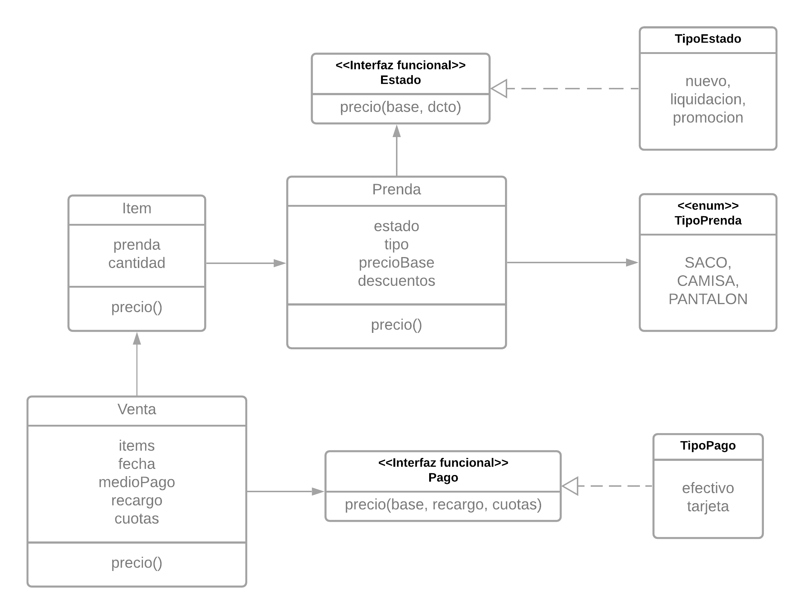

# Maco Wins

## Contenido

- Consigna
  - Requisitos
  - Enunciado
- Resolución

## Consigna

### Requisitos

- Identificar los requerimientos
- Presentar una solución utilizando el paradigma objetos
- Explicar lo necesario en prosa
- Si se descarta alguna alternativa durante el desarrollo de la solución, o si se tiene otra solucióm, explicarla brevemente

### Enunciado

La conocida empresa de ropa formal para caballeros, Macowins, es capaz de darle soporte a la venta de prendas. Un fragmento de la grabación del analista con el cliente:

> “Queremos saber el precio de venta de una prenda y sus tipos, los tipos de prenda son: sacos, pantalones, camisas.”

El cálculo del precio de una prenda es, el precio propio de la prenda modificado según el estado de la prenda, que pueden ser:

- _Nueva_: en este caso no modifican el precio base.
- _Promoción_: Le resta un valor fijo decidido por el usuario.
- _Liquidación_: Es un 50% del valor del producto.

Ah, un requerimiento más: Macowins registra las ventas de estas prendas y necesita saber las ganancias de un determinado día.

> “Cada venta tiene asociada las prendas que se vendieron, su cantidad y la fecha de venta.
> Las ventas pueden ser en efectivo o con tarjeta. En el caso que sea con tarjeta, tienen el mismo comportamiento que en efectivo (el cual no modifica el precio), sólo que se le aplica un recargo según la cantidad de cuotas seleccionadas (cantidad de cuotas \* un coeficiente fijo + 0.01 del valor de cada prenda).”

## Resolución

### Requerimientos

- Permitir consultar: precio, tipo de una venta de prenda.
- Resumen de ganacia de un determinado día.

### Diagrama



### Atendiendo requerimientos

> Consultar precio de un prenda

Para calcular el precio, delegamos en su estado...

```java
class Prenda{
  //...
  double precio(){
    return estado.precio(this.precioBase, this.descuento);
  }
}
```

Siendo su calculo...

```java
@FunctionalInterface
 public interface Estado{
   precio(double precioBase, double descuento);
 }

public class TipoEstado{
  // El precio sin modificaciones
  static Estado nuevo = ((p, d) -> p);
  // El precio - el descuento
  static Estado promocion = ((p, d) -> p - d);
  // Mitad de precio
  static Estado liquidacion = ((p, d) -> p * 0.5);
}
```

Opté por esta solución ya que lo que buscaba era tener una clase, las cuales de sus objetos sólo varie la lógica de un cálculo.

Mi idea principal era pasar una función al construir cada objeto. Investigando, llegué a que lo que quería lograr podría plantearse de esta forma.

> Permitir consultar su tipo

```java
public enum TipoPrenda{
  SACO, CAMISA, PANTALON
}

class Prenda{
  TipoPrenda tipo;
}
```

> Saber las ganancias de un determinado día

```java
class Venta{
  LocalDate fecha;
  List<Item> items;
  TipoPago medioDePago;
  int cuotas;
  double coefDeRecargo;

  double precio(){
    double subTotal = items.stream().mapToDouble( i -> i.precio()).sum();
    return medioDePago.precio(subTotal, coefDeRecargo, cuotas);
  }
}
```

donde un Item no es mas que:

```java
class Item{
  Prenda prendas;
  int cantidad;

  double precio(){ return prenda.precio() * cantidad;}
}
```

Y al igual que con los `Estados`, el `TipoPago`, aplica una lógica similar...

```java
@FunctionalInterface
interface Pago{
  public double precio(double subtotal, double coeficiente, int cuotas);
}

class TipoPago{
  // No modifica
  static Pago efectivo = ((t, coef, c) -> t);
  // Tiene un calculo particular
  static Pago tarjeta = ((t, coef, c) -> c * coef + 0.01 * t);
}
```

Asumiendo que se cuenta con una `ArrayList<Venta> ventas` donde estan listadas todas las ventas de varios días...

Uno debería filtrar las ventas al día en cuestión(`filter`), luego obtener el precio de cada una de las ventas (`map`) y sumarizar esto (`sum/reduce/fold`).

```java
public Venta{
  // ...
  static public resumenDel(List<Venta> ventas, LocalDate fecha){
    ventas.stream().filter( v -> v.fecha.equals(fecha)).mapToDouble( v -> v.precio()).sum();
  }
}
```
