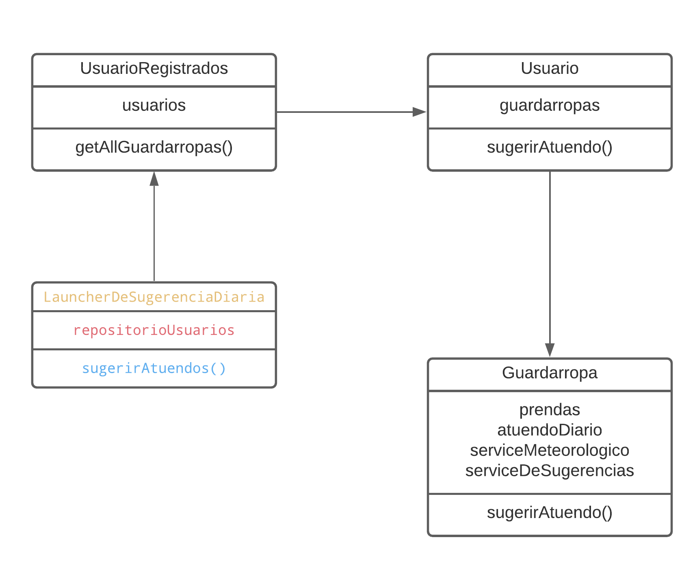

# Qué Me Pongo V6

## Nuevos Requerimientos

Partiendo de la [versión anterior](./05-qmp.md), ahora se pide:

- Tener una sugerencia diaria de qué ponerme y que todas las mañanas, diariamente, esta sea actualizada.

- Poder disparar el cálculo de sugerencias diarias para todos los usuarios para poder ejecutar esta acción a principio de cada día.

- Poder conocer cuáles son las últimas alertas meteorológicas publicadas en el sistema para estar informado (pudiendo verlas, por ejemplo, al entrar en quemepongo.com).

- Poder disparar un proceso que consulte y actualice la lista de alertas publicadas en el sistema para tener control sobre cuándo se publican las mismas.

- Que se actualice mi sugerencia diaria con las condiciones climáticas actualizadas cuando se genere algún alerta durante el día.

- Tener la posibilidad de que ante una alerta de tormenta la app me notifique que debo llevarme también un paraguas.

- Que ante una alerta meteorológica de granizo la app me notifique que evite salir en auto.

- Poder recibir un mail avisándome si se generó algún alerta meteorológico y cuál.

- Quiero poder configurar cuáles de estas acciones (notificaciones, mail, recálculo) quiero que se ejecuten y cuáles no, además de soportar nuevas acciones a futuro. (No nos interesará, sin embargo, soportar nuevas alertas)

## Resolución por Requerimientos

### Tener una sugerencia diaria de qué ponerme

Aprovechamos que ya el `Guardarropa` sugería atuendos...
(Iteración IV)


La implementación utilizada fue:

```java
public class SugerenciasDeGuardarropa {

  public Atuendo sugerirAtuendo() {
          return new Atuendo(sugerirConjuntoSegunClima());
      }

  private Conjunto sugerirConjuntoSegunClima() {
      Clima clima = condicionesClimaticas.getClima();

      return new Conjunto(
              sugerirPrenda(Categoria.SUPERIOR, clima),
              sugerirPrenda(Categoria.INFERIOR, clima),
              sugerirPrenda(Categoria.CALZADO, clima),
              sugerirPrenda(Categoria.ACCESORIOS, clima)
            );
  }

  /**
   * Busca una Prenda segun el clima.
   *
   * @param categoria la categoria de la prenda a buscar
   * @return una prenda apta para el clima
   */
  private Prenda sugerirPrenda(Categoria categoria, Clima clima) {

      Set<Prenda> prendasDeCategoria = prendas.get(categoria);
      Optional<Prenda> prenda =
              prendasDeCategoria.stream().filter(p -> p.getTipo().aptoClima(clima)).findAny();

      return prenda.isPresent() ? prenda.get() : null;
  }
}
```

### Disparar el cálculo de sugerencias diarias para todos los usuarios

Para lograr esto, necesitariamos una consistencia donde se encuentren los usuarios, para ello se implementó un _Repository_



Aparece el `LauncherDeSugerencia` para no otorgarle la responsabilidad al _repository_ ni hacer que los guardarropas conozcan a un repositorio.

```java
public class LauncherDeSugerenciaDiaria{

  public LauncherDeSugerenciaDiaria sugerirAtuendos() {

      getRepositorio()
        .getAllGuardarropas()
        .forEach(Guardarropa::sugerirAtuendo);

      return this;
  }
}
```

### Conocer cuáles son las últimas alertas meteorológicas publicadas en el sistema

Analogamente a los usuarios, utilizaremos un _Repository_ de alertas


Por lo cual desde para conocer las alertas se debería pegarle al _repository_

```java
public enum AlertaClimatica {
  TORMENTA,
  GRANIZO,
  NEVADA;
}
```

### Disparar un proceso que consulte y actualice la lista de alertas publicadas

Utilizamos el `ServicioMeteorologico` para obtener las alertas. Y las guardamos en el _Repository_

```java
public class PublicadorDeAlertas{

  ServicioMetereologico serviceMetereologico = ServicioMetereologico.defaultService();

  AlertasPublicadas repositorio;

  public PublicadorDeAlertas actualizarAlertas() {
      getServiceMetereologico()
        .getAlertas("Buenos Aires")
        .addAll(getRepositorio().getAlertas());
      return this;
  }

}
```

### Actualizar sugerencia diaria con las condiciones climáticas

Inyectamos al publicador con el ya mencionado `LauncherDeSugerenciaDiaria`, por lo cual, siempre que actualizen las alertas, se actualizaran las sugerencias de TODOS los usuarios de igual manera que al principio del día

```java
public class PublicadorDeAlertas{

  ServicioMetereologico serviceMetereologico = ServicioMetereologico.defaultService();

  AlertasPublicadas repositorio;
  LauncherDeSugerenciaDiaria sugerenciasLauncher;

  public PublicadorDeAlertas actualizarAlertas() {

      getServiceMetereologico()
        .getAlertas("Buenos Aires")
        .addAll(getRepositorio().getAlertas());

      actualizarSugerencias();

      return this;
  }

  private void actualizarSugerencias() {
    getSugerenciasLauncher().sugerirAtuendos();
  }

}

//Recordemos el Launcher...
public class LauncherDeSugerenciaDiaria{

  public LauncherDeSugerenciaDiaria sugerirAtuendos() {
      getRepositorio()
        .getAllGuardarropas()
        .forEach(Guardarropa::sugerirAtuendo);
      return this;
  }
}
```

### Ante alerta de tormenta la app me notifique que debo llevarme también un paraguas

Aprovechando `AlertaClimatica`...

```java
public enum AlertaClimatica {

  TORMENTA("Se esperan Tormentas :: Lleve paraguas!"),
  /**
   * Alerta de tormenta.
   */
  GRANIZO,
  /**
   * Alerta de nevadas.
   */
  NEVADA;

  private final String MSG;

  /**
   * Notifica la alerta climatica.
   *
   * @param service el servicio de noticacion
   * @since Iteración VI
   */
  public AlertaClimatica notificar(NotificationService service) {
      service.notify(getMessage());
      return this;
  }
}
```

### Ante alerta meteorológica de granizo la app me notifique que evite salir en auto.

De igual manera...

```java
public enum AlertaClimatica {

  TORMENTA("Se esperan Tormentas :: Lleve paraguas!"),
  GRANIZO("Alerta de Granizo! :: Evite el uso de automóviles"),
  NEVADA("Se esperan nevadas!");

  private final String MSG;

  /**
   * Notifica la alerta climatica.
   *
   * @param service el servicio de noticacion
   * @since Iteración VI
   */
  public AlertaClimatica notificar(NotificationService service) {
      service.notify(getMessage());
      return this;
  }
}
```

### Poder recibir un mail avisándome si se generó algún alerta meteorológico y cuál

Modificando nuevamente el `PublicadorDeAlertas`, añadiendo `notificarAlertas()`.

```java
public PublicadorDeAlertas actualizarAlertas() {
      List<AlertaClimatica> alertas = getServiceMetereologico().getAlertas("Buenos Aires");
      notificarAlertas(alertas);
      alertas.addAll(getRepositorio().getAlertas());
      actualizarSugerencias();
      return this;
  }

  private void notificarAlertas(List<AlertaClimatica> alertas) {
    alertas
      .forEach(alerta ->
                alerta.notificar(notificationService)
              );
    enviarMailDeAlertas(alertas);
  }

  private void enviarMailDeAlertas(List<AlertaClimatica> alertas) {
    alertas.forEach(alerta -> {
        List<String> mails = getSugerenciasLauncher().getRepositorio().getMailsIfSoporta();
        mails.forEach(mail -> alerta.notificar(mailSender, mail));
    });
  }
}
```

Donde cada alerta sabe como notificarse.

```java
public enum AlertaClimatica{

  TORMENTA("Se esperan Tormentas :: Lleve paraguas!"),
  GRANIZO("Alerta de Granizo! :: Evite el uso de automóviles"),
  NEVADA("Se esperan nevadas!");

  private final String MSG;

  public AlertaClimatica notificar(MailSender service, String mail) {
    service.send(mail, getMessage());
    return this;
  }
}
```

### Quiero poder configurar cuáles de estas acciones se ejecute

Simplemente agregamos un propiedad en los usuarios que permite identificar que acciones quiere poder ejecutar.

```java
class Usuario{

  private List<Accion> accionesConfigurables =
          new ArrayList<Accion>(Arrays.asList(Accion.values())) {};

           public List<Accion> getAcciones() {
        return accionesConfigurables;
    }

  public Usuario addAccion(Accion accion) {
      getAcciones().add(accion);
      return this;
  }

  public Usuario removeAccion(Accion accion) {
      getAcciones().remove(accion);
      return this;
  }

  public boolean aceptaAccion(Accion accion) {
      return getAcciones().contains(accion);
  }
}
```

Luego una `Accion`

```java
public enum Accion {
    NOTIFICACIONES, MAIL, RECALCULO;
}
```

Finalmente, modificamos el repositorio, para que este puede filtrar los usuarios segun la accion que se desea ejecutar, por ejemplo...

```java
class UsuariosRegistrados{

  public List<Usuario> getUsuarios(Accion accion) {
    return getUsuarios()
            .stream()
            .filter(user -> user.aceptaAccion(accion))
            .collect(Collectors.toList());
  }


  public List<Guardarropa> getGuardarropasForRecalculo() {
      List<Guardarropa> guardarropas = new ArrayList<Guardarropa>();

      getUsuarios(Accion.RECALCULO)
        .stream()
        .map(Usuario::getAllGuardarropas)
        .collect(Collectors.toList())
        .forEach(list -> list.addAll(guardarropas));

      return guardarropas;
  }
}

```
