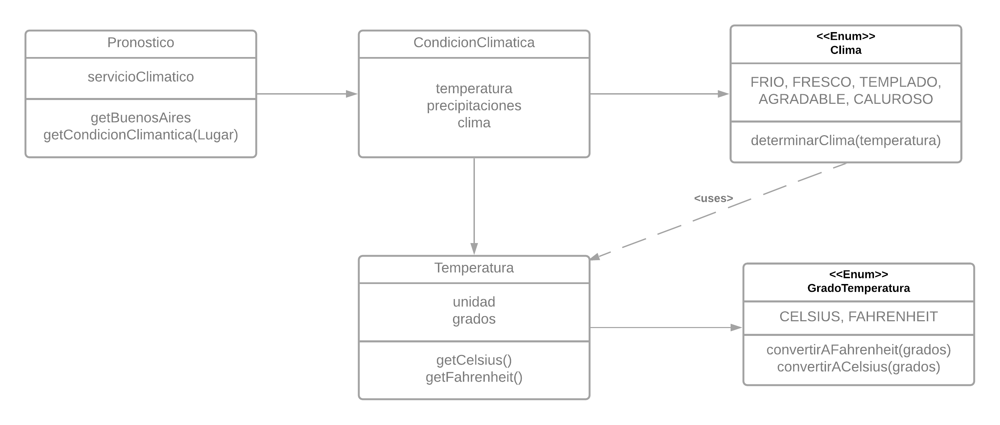
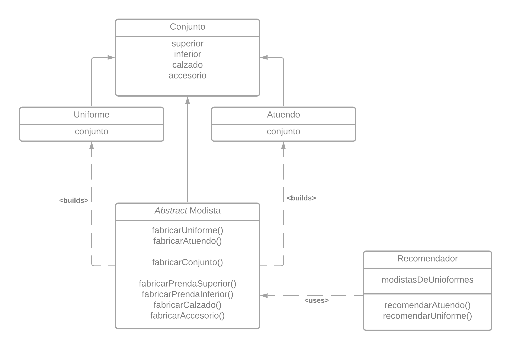
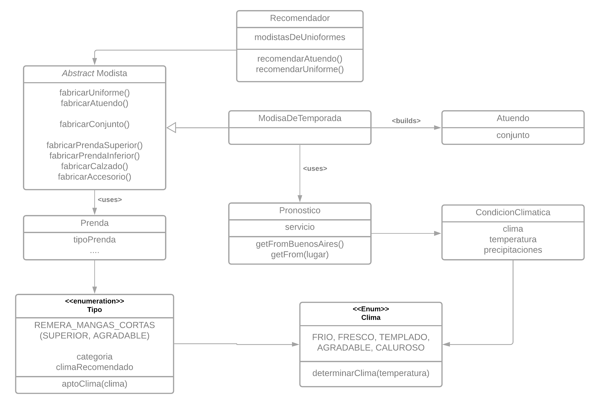
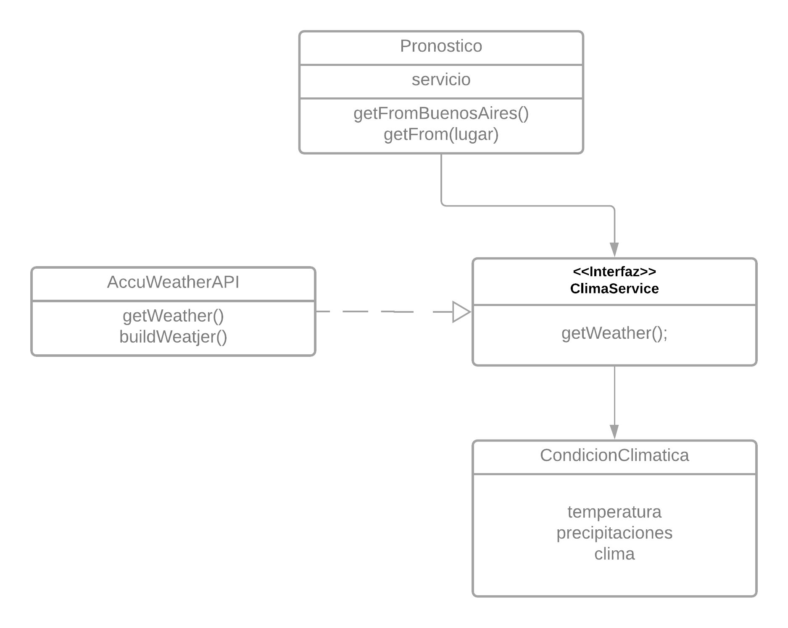

# Qué Me Pongo V4

## Nuevos Requerimientos

Partiendo de la [versión anterior](./02-qmp.md), ahora se pide:

- Poder conocer las condiciones climáticas de Buenos Aires en un momento dado para obtener sugerencias acordes.
- Recibir sugerencias de atuendos que tengan una prenda para cada categoría, , aunque a futuro podrán tener más.
- Al generar una sugerencia las prendas sean acordes a la temperatura actual sabiendo que para cada prenda habrá una temperatura hasta la cual es adecuada.
- Configurar fácilmente diferentes servicios de obtención del clima para ajustarme a las cambiantes condiciones económicas
- Asegurar la calidad de mi aplicación sin incurrir en costos innecesarios.

## Solución

### Conocer las condiciones climáticas.



Existe un `Pronóstico` que permite determinar el clima del instante en el que se lo solicite.

```java
class Pronostico{

  CondicionClimatica getBuenosAires();
}
```

Éste pronóstico obtiene una `CondicionClimatica`, la cual provee **abstracción**.

```java
class CondicionClimatica{
  Temperatura temperatura;
  double precipitaciones;
  Clima clima;
}
```

La misma se conforma de `Temperatura` que abstrae los grados y la unidad de medida, además de permitir realizar las conversiones de unidades.

Por otro lado el `Clima` es determinado segun la temperatura.

### Recibir sugerencias de Atuendos

Recordemos que poseíamos un `Recomendador` de la [iteración anterior](./02-qmp.md), el cual recomendaba `Uniformes`.



Notamos ciertas _repeticiones_ en cuanto a `Uniforme` y `Atuendo`, por lo cual decido en extraerlas a una clase `Conjunto`, para no crear una **herencia** que podría limitarnos.

```java
class Conjunto{
  Prenda superior;
  Prenda inferior;
  Prenda calzado;
  Prenda accesorio;
}
```

Tendremos que refactorizar los métodos de la `Factory de Prendas` presentada en la iteración anterior.

Sin embargo esto resulta muy sencillo:

Recordemos la iteración anterior poseíamos

```java
abstract class Modista{
  Uniforme fabricarUniforme(){
    return new Uniforme(fabricarPrendaSuperior(), fabricarPrendaInferior(), ...);
  }
}
```

Refactorizando...

```java
abstract class Modista{

  Uniforme fabricarUniforme(){
    return new Uniforme(fabricarConjunto());
  }

  Atuendo fabricarAtuendo(){
    return new Atuendo(fabricarConjunto());
  }

  Conjunto fabricarConjunto(){
    return new Conjunto( fabricarPrendaSuperior(),
                         fabricarPrendaInferior(),
                         ...);
  }
}
```

Por lo cual, una solución sería que el `Recomendador`utilice un `Modista` que fabrique un atuendo para recomendar.

### Prendas acordes a la temperatura actual

De manera análoga a cómo recomendabamos uniformes...



Una solución: aprovechar el factory `Modista`, creando una subclase, `ModistaDeTemporada`, que se encargue de fabricar los atuendos.

Para ello utilizará el `Pronóstico` anterior, el cual permite obtener el `Clima`.

Agregaremos una funcionalidad de permitir identificar a las prendas con una `aptitudClimatica` que determine para que clima es apta la prenda. Esto, al igual que con `Categoría` es intrínseco al `TipoPrenda`.

```java
class ModistaDeTemporada extends Modista{
  // Este pronóstico utiliza el servicio climático por defecto.
  private Clima pronositco = new Pronostico();

  private Prenda bosquejarClimaticamente(Categoria categoria){
      return new Bosquejo()
                  .setTipo(getTipoClimatico(categoria))
                  .setMaterial(getMaterialClima())
                  .setColor1(getColorDelClima())
                  .guardarPrenda();
  }

  private TipoPrenda getTipoClimatico(){
    Clima actual = pronostico.getBuenosAires().getClima();

    //Delego en Tipo Prenda obtener un elemento random que cumpla
    return TipoPrenda
              .getRandom( tipo ->
                          tipo.aptoClima(actual)
                        );
  }

  @Override
  public Prenda fabricarPrendaSuperior(){
      return bosquejarClimaticamente(Categoria.SUPERIOR);
  }

  @Override
  public Prenda fabricarPrendaInferior(){
      return bosquejarClimaticamente(Categoria.INFERIOR);
  }

  // Y así con el resto...

}
```

### Configurar fácilmente diferentes servicios de obtención del clima



Recordamos para obtener la conidición climática utilizamos un `Pronostico`:

```java
class Pronostico{

  private ClimaService servicio;

  public CondicionClimatica getFromBuenosAires(){
    return getFrom("Buenos Aires");
  }

  public CondicionCimatica getFrom(String lugar){
    return servicio.getWeather(lugar);
  }
}
```

Utiliza un `ClimaService` para poder obtener las condiciones climaticas.

```java
public interface ClimaService{

  CondicionClimatica getWeather(String lugar);
}
```

Por lo cual, podría utilizar cualquier servicio, siempre y cuando se acomode a ajustar la interpretación de los datos.

Un ejemplo sería:

```java
new Pronostico(new WeatherAPI());
```

Por default utilizaría el servicio de `AccuWeatherAPI`.
