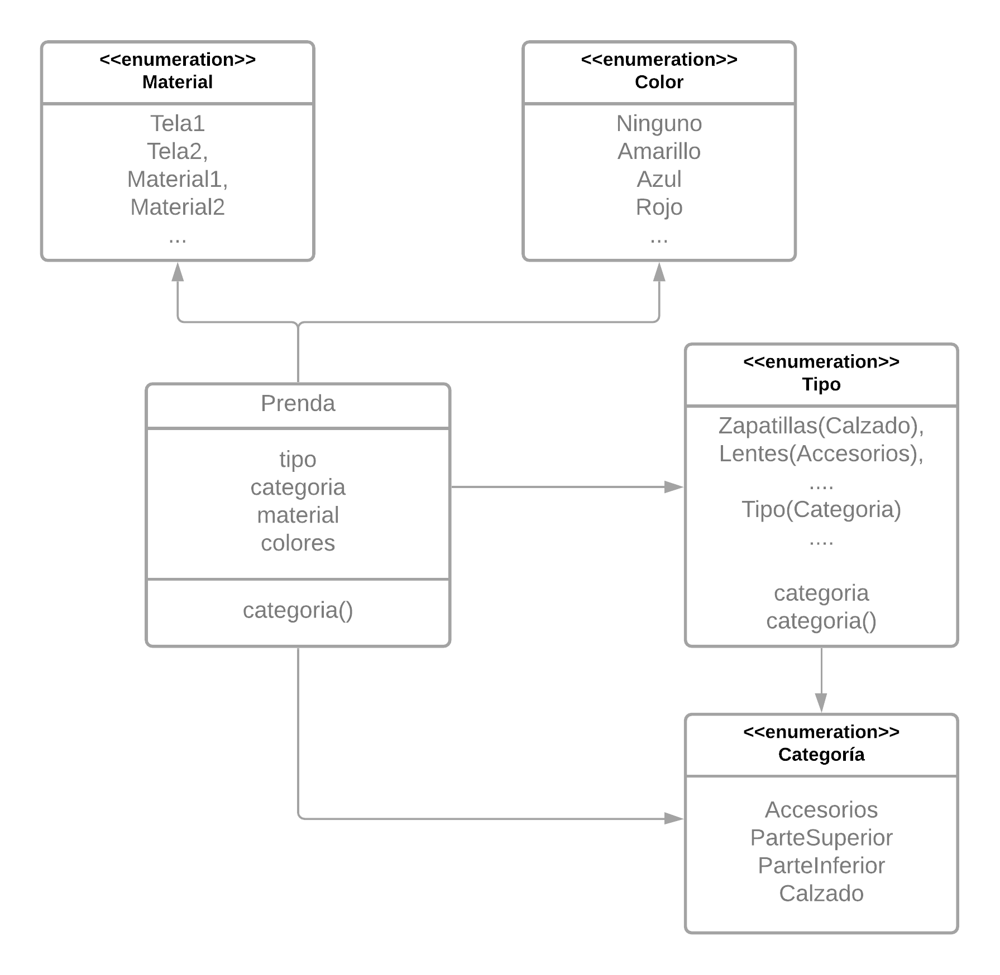
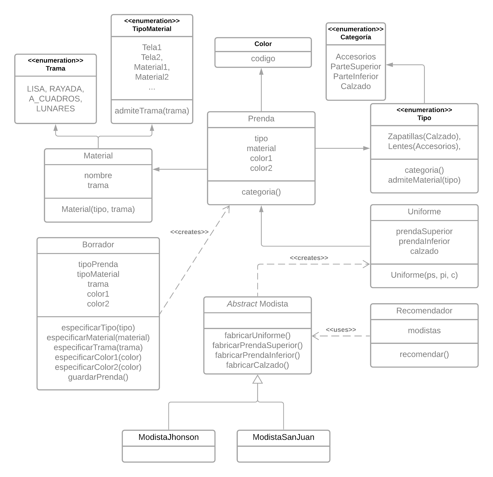

# Qué Me Pongo V2

## Nuevos Requerimientos

Partiendo de la [versión anterior](./01-qmp.md), ahora se pide:

- Especificar qué trama tiene la tela de una prenda (lisa, rayada, con lunares, a cuadros o un estampado).

- Crear una prenda especificando primero de qué tipo es.
- Crear una prenda especificando en segundo lugar los aspectos relacionados a su material (colores, material, trama, etc) para evitar elegir materiales inconsistentes con el tipo de prenda.
- Guardar un borrador de la la última prenda que empecé a cargar para continuar después.
- Poder no indicar ninguna trama para una tela, y que por defecto ésta sea lisa.
- Guardar una prenda solamente si esta es válida.

> Por otro lado, el equipo de producto está analizando potenciales futuras funcionalidades para la aplicación y, a fin de tener una estimación de su complejidad, nos pidió que esbocemos una solución a los siguientes requerimientos, orientados a integrar el software con colegios e instituciones privadas:

- Poder recibir sugerencias de uniformes armados.
- Que un uniforme siempre conste de una prenda superior, una inferior y un calzado
- Poder configurar diferentes uniformes para distintas instituciones

## Solución

### Diagrama de classes

#### Iteración I



#### Iteración II



### Atendiendo Requerimientos.

> Especificar qué trama tiene la tela de una prenda

Para esto, primero necesitariamos un _dominio_ de tramas

```java
enum TramaTela{
  LISA, RAYADA, A_CUADROS, LUNARES, ESTAMPADO
}
```

> Crear una prenda especificando primero de qué tipo es.

Esto advertiría que el primer parametro es el `TipoPrenda`, por lo cual, un constructor podría ser...

```java
class Prenda{

  public Prenda(TipoPrenda tipo){
    // Validación de no NULL (Iteración I)...
    this.tipo = tipo;
  }
}
```

> Especificando en segundo lugar los aspectos relacionados a su material

Por lo cual modificado lo anterior...

```java
class Prenda{

  public Prenda(TipoPrenda tipoPrenda, TipoMaterial material, TramaPrenda trama, ...){
    // Validación de no NULL (Iteración I)...
  }
}
```

Luego para:

> Evitar elegir materiales inconsistentes con el tipo de prenda

Deberiamos refactorizar nuestro `Material` de la iteración anterior, que era un enum, ahora pasará a llamarse `TipoMaterial`.

Decidí delegar en el estos si acepta el tipo de trama, para lo cual cada tipo de material poseera una lista de tramas que admite.

```java
enum TipoMaterial{
 // Materiales...

  List<TramaTela> tramas;

  boolean admiteTrama(TramaTela trama){
   tramas.stream().any( tramaAdmitida -> tramaAdmitida.equals(trama));
  }
}
```

Por otro lado, `Material` ahora será una clase que sólo dejaría combinar los tipos de materiales ciertas tramas. Lanzando un `RuntimeException` de no ser compatibles.

```java
class Material{
  TipoMaterial material;
  TramaTela trama;

  Material(Tipomaterial material, trama){
     if(!this.material.admiteTrama(trama))
      throw  new MaterialInvalido();
  }
}
```

Análogamente, cada Tipo de Prenda decidirá si acepta el material.

```java
enum TipoPrenda{
  // Tipos y categorías resueltas...

  List<TipoMaterial> materiales;

  boolean admiteMaterial(TipoMaterial trama){
    return tramas
            .stream()
            .any( materialAdmitido -> materialAdmitido.equals(material));
  }
}
```

Finalmente la `Prenda` valida si el `TipoPrenda` acepta el `TipoMaterial`, luego `new Material(m, t)` verificará si puede asignarse esa trama a ese material.

```java
class Prenda{

  public Prenda(TipoPrenda tipoPrenda, TipoMaterial material, TramaTela trama, ...){
    // Validación de no NULL (Iteración I)...

    // Nueva validación de consistencia
    if(!tipoPrenda.admiteMaterial(material))
      throw new PrendaInvalida("El tipo de prenda no admite el material seleccionado.");

    this.tipoPrenda = tipoPrenda;
    // El material válida si admite la trama.
    this.material = new Material(material, trama);
    // ..
  }
}
```

> Poder no indicar ninguna trama para una tela, y que por defecto ésta sea lisa.

Podemos contar con otro constructor para `Prenda` dónde llame al siguiente pasándole `TramaTela.LISA` como valor default.

```java
    public Prenda(TipoPrenda tipoPrenda, TipoMaterial material, Color color1) {
        this(tipoPrenda, material, TramaTela.LISA, color1, null);
    }
```

> Guardar un borrador de la la última prenda que empecé a cargar para continuar después.

Asumo que después de la Iteración I, no pueden permanecer algunos campos vacíos, luego para _continuar después_ deberían haber algunos `setters`.
Sin embargo opto por la alternativa de crear una nueva clase `Borrador`, que haría de _builder_,utilizando las propiedades de `Prenda` para luego construir una, y esta verifique que siempre se cree una válida.

```java
class Borrador {

  TipoPrenda tipo;
  TipoMaterial material;
  TramaTela trama;
  Color color1;
  Color color2;

  // Setters correspondientes
}
```

> Guardar una prenda solamente si esta es válida.

En nuestro `Borrador`, según la iteración anterior, y lo ampliado en esta, tomo cómo hipótesis de trabajo que **todas** las instancias de `Prenda` **existentes son válidas** ya que de no serlo no se instanciarían en primer lugar (_fail fast_).

```java
class Borrador{
  // ...

  // Delego en la prenda la validación. Recordemos que de las tramas default se encarga el material.
  public Prenda guardarPrenda() {
    return new Prenda(tipo, material, trama, color1, color2);
  }
}
```

> Por otro lado, el equipo de producto está analizando potenciales futuras funcionalidades para la aplicación y, a fin de tener una estimación de su complejidad, nos pidió que esbocemos una solución a los siguientes requerimientos, orientados a integrar el software con colegios e instituciones privadas:

Empezamos definiendo qué es un Uniforme

> Que un uniforme siempre conste de una prenda superior, una inferior y un calzado

```java
class Uniforme{
  Prenda superior;
  Prenda inferior;
  Prenda calzado;
}
```

> Poder configurar diferentes uniformes para distintas instituciones

Podríamos aplicar un _dessing pattern_ de _Factory Method_

```java
abstract class Modista{

  public Uniforme fabricarUniforme(){
    return new Uniforme(
      this.fabricarPrendaSuperior(),
      this.fabricarPrendaInferior(),
      this.fabricarCalzado()
      );}

  protected abstract Prenda fabricarPrendaSuperior();
  protected abstract Prenda fabricarPrendaInferior();
  protected abstract Prenda fabricarCalzado();
}
```

Y, aprovechando el ejemplo...

Cada Institución tendría su `Modista`. Además aprovechamos el _builder_ de prendas `Borrador`.

```java
public class ModistaSanJuan extends Modista {

    @Override
    protected Prenda fabricarPrendaSuperior() {

        Borrador bosquejo = new Borrador();
        bosquejo.especificarTipo(TipoPrenda.CHOMBA);
        bosquejo.especificarMaterial(TipoMaterial.ALGODON);
        bosquejo.especificarColorPrimario(new Color("#verde"));

        return bosquejo.guardarPrenda();
    }
  // y Así con los demás métodos
}
```

De igual manera aplica para la otra institución...

```java
class ModistaJhonson extends Modista{

    @Override
    protected Prenda fabricarPrendaInferior() {

        Borrador bosquejo = new Borrador();
        bosquejo.especificarTipo(TipoPrenda.PANTALON);
        bosquejo.especificarMaterial(TipoMaterial.ACETATO);
        bosquejo.especificarColorPrimario(new Color("#negro"));

        return bosquejo.guardarPrenda();
    }
    // y Así con los demás métodos
}
```

> Poder recibir sugerencias de uniformes armados.

Finalmente, para cumplir este requerimiento, necesitaríamos un `Recomendador`.

Para "recomendar", tendría un listado con todos los `Modistas` existentes, y haría que alguno _fabrique_ un uniforme.

```java
class Recomendador{
  private ArrayList<Modista> modistas;

  public Uniforme recomendar(){
    return modistas
          .getIndex(new Random().nextInt(modistas.size()))
          .fabricarUniforme();
  }
}
```
