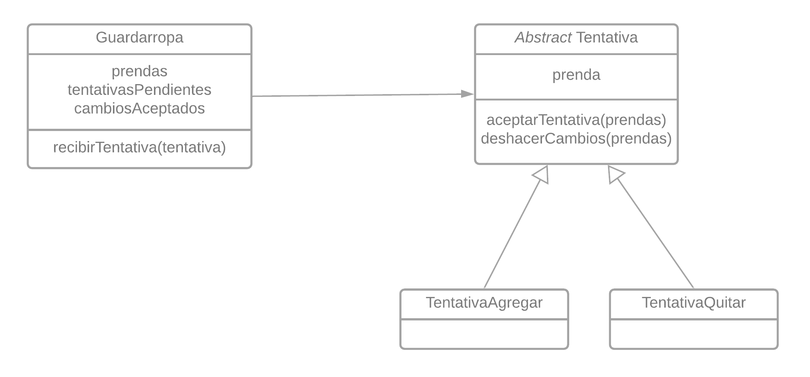

# Qué Me Pongo V4

## Nuevos Requerimientos

Partiendo de la [versión anterior](./04-qmp.md), ahora se pide:

- Manejar varios guardarropas para separar mis prendas según diversos criterios (ropa de viaje, ropa de entrecasa, etc).

- Poder crear guardarropas compartidos con otros usuaries (ej, ropa que comparto con mi hermane).

- Que otro usuario me proponga tentativamente agregar una prenda al guardarropas.

- Que otro usuario me proponga tentativamente quitar una prenda del guardarropas.

- Ver todas las propuestas de modificación (agregar o quitar prendas) del guardarropas y poder aceptarlas o rechazarlas...

- Poder deshacer las propuestas de modificación que haya aceptado.

## Resolución

### Manejar varios guardarropas según diversos criterios.


Definimos un `Usuario` como:

```java
class Usuario{

  private Map<Criterio, Guardarropa>guardarropas;

  public void nuevoGuardarropa(Criterio criterio){
    guardarropas.put(criterio, new Guardarropa());
  }
}
```

Mientras que un `Guardarropa` sería...

```java
class Guardarropa{

  private Map<Categoria, Set<Prenda>> prendas;

  public Guardarropa agregarPrenda(Prenda prenda){
    prendas.get(prenda.categoria()).put(prenda);
    return this;
  }

}
```

### Crear guardarropas compartidos con otros usuaries

Modificamos levemente nuestro `Usuario`


Consideramos necesario poder identificar a quién pertenece el `Guardarropa` compartido.

Para además compartir distintos guardarropas, no solamente se necesitaría el `Usuario` dueño del guardarropas sino también el `Criterio` para identificarlo unívocamente.

```java
class Usuario{
  // Implementación anterior [...]
  Map<Usuario, Map<Criterio, Guardarropa>> guardarropasDeOtros;

  public Usuario agregarGuardarropaAjeno(Usuario usuario, Criterio criterio) {
    siNoExisteAgregarCompartido(usuario);
    agregarGuardarropaCompartido(usuario, criterio);
    return this;
  }

  private void siNoExisteAgregarCompartido(Usuario usuario) {
    if (!guardarropasDeOtros.containsKey(usuario)) {
        guardarropasDeOtros.put(usuario, new HashMap<String, Guardarropa>());
    }
  }

  private void agregarGuardarropaCompartido(Usuario usuario, String criterio) {

    Map<String, Guardarropa> guardarropas = this.guardarropasDeOtros.get(usuario);
    Guardarropa guardarropa = usuario.getGuardaropa(criterio);
    guardarropas.put(criterio, guardarropa);
  }

}
```

### Tentativas



Primero definimos `Tentativa` como:

```java
abstract class Tentativa{
  private Prenda tentativa;

  public getTentativa(){ return this.tentativa; }
  public categoria(){ return this.getTentativa().categoria();}

  protected abstract void aceptarTentativa(Set<Prenda> prendas);
  protected abstract void deshacercambios(Set<Prenda> prendas);
}
```

#### Que otro usuario me proponga tentativamente agregar una prenda al guardarropas.

Para no recaer en _Type checks_ utilizamos `TentativaAgregar`

```java
class TentativaAgregar extends Tentativa{

  @Override
  void aceptarTentativa(Set<Prenda> prendas){
    prendas.add(getTentativa());
  }

  @Override
  void deshacercambios(Set<Prenda> prendas){
    prendas.remove(getTentativa());
  }

}
```

Por lo cual si un usuario quisiera realizar una tentativa:

```java
class Usuario{

  void proponerAgregar(Guardarropa guardarropa,Prenda prenda){
    // Verifico si puedo utilizar ese guardarropa
    validarAcceso(guardarropa);
    guardarropa.recibirTentativa(new TentativaAgregar(prenda));
  }
}
```

#### Que otro usuario me proponga tentativamente quitar una prenda del guardarropas.

```java
class TentativaQuitar extends Tentativa{

  @Override
  void aceptarTentativa(Set<Prenda> prendas){
    prendas.remove(getTentativa());
  }

  @Override
  void deshacercambios(Set<Prenda> prendas){
    prendas.add(getTentativa());
  }

}
```

---

Mientras qe por el lado del `Guardarropa`, no distingue si son `TentativaAgregar` o `TentativaQuitar`.

```java
class Guardarropa{

  Set<Tentativa> tentativasPendientes;

  void recibirTentativa(Tentativa tentativa){
    tentativasPendientes.add(tentativa);
  }
}
```

#### Ver todas las propuestas de modificación (agregar o quitar prendas) del guardarropas y poder aceptarlas o rechazarlas...

Ya tenemos casi todo lo necesario...

```java
class Guardarropa{

  public Set<Tentativa> getTentativas(){ return this.tentativasPendientes }

  public void aceptarTentativa(Tentativa tentativa){
    tentativasPendientes.remove(tentativa);
    // Agrego en la lista correspondiente a la categoria.
    tentativa.aceptarTentativa(getPrendas(tentativa.categoria()));
  }

  public void rechazarTentativa(Tentativa tentativa){
    // Unicamente las borro de la lista
    tentativasPendientes.remove(tentativa);
  }

  public Set<Prendas> getPrendas(Categoria categoria){
    return this.prendas.get(categoria);
  }
}
```

Por lo cual si quisiera agregar una tentativa...

```js
  Tentativa tentativa = guardarropa
                          .getTentativas()
                          .stream()
                          .findAny()
                          .get();

   guardarropa.aceptarTentativa(tentativa);
   // o bien
   guardarropa.rechazarTentativa(tentativa);
```

#### Poder deshacer las propuestas de modificación que haya aceptado.

Para ello llegamos a considerar necesario llevar tracking de las alternativas aceptadas.

```java
class Guardarropa{

  Set<Tentativa> tentativasAceptadas;

  public void aceptarTentativa(Tentativa tentativa){
    tentativasPendientes.remove(tentativa);
    // Agrego en la lista correspondiente a la categoria.
    tentativa.aceptarTentativa(getPrendas(tentativa.categoria()));
    // además guardo en la nueva lista de Tentativas aceptadas
    tentativasAceptadas.add(tentativa);
  }

  //Luego para por deshacer los cambios
  public void deshacerCambios(Tentativa tentativa){
    // Realizamos el proceso inverso
    tentativasPendientes.add(tentativa);
    // Elimino de la lista correspondiente
    tentativa.deshacerCambios(getPrendas(tentativa.categoria()));
    tentativasAceptadas.remove(tentativa);
  }

}
```

Un ejemplo de uso sería...

```js
  Tentativa tentativa = guardarropa
                          .getTentativasAceptadas()
                          .stream()
                          .findAny()
                          .get();

   guardarropa.deshacerCambios(tentativa);
```
