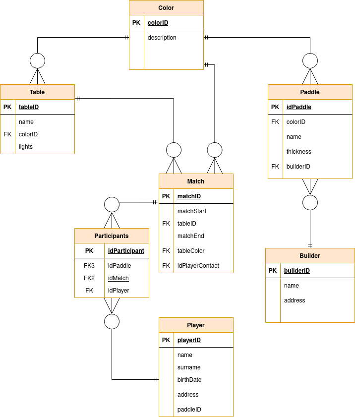

# Normalization & ORM

## Content

- Normalizing
  - ERD
- ORM

## Normalizing

## Basic

|   ID    | Name   | Lights | Color | Match Start | Players                                                   |
| :-----: | :----- | -----: | :---- | :---------: | :-------------------------------------------------------- |
| ABC3000 | Nerone |    Yes | Red   |    17:40    | {Titus, Pullus, Rome 2021, { The best, Wilson, Red}}, ... |

### Entity Relation Diagram

## Object Relation Mapping

Persistency with [JPA](https://docs.google.com/document/d/1dYvrVLRbFE9qwuKj5biz9oRBaRzj-K6ujIKOXNan02s/edit#heading=h.kkyach7i1h8n)
